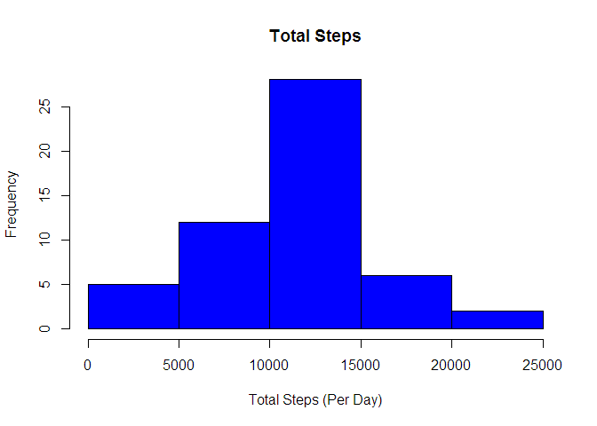
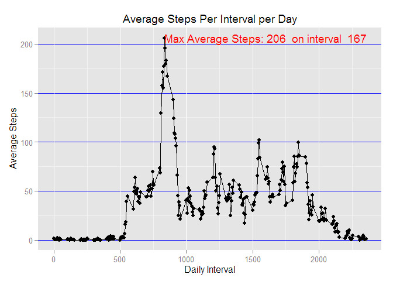
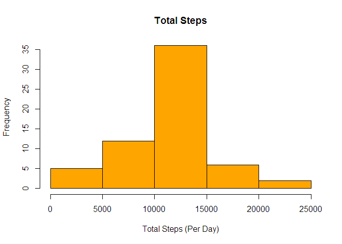
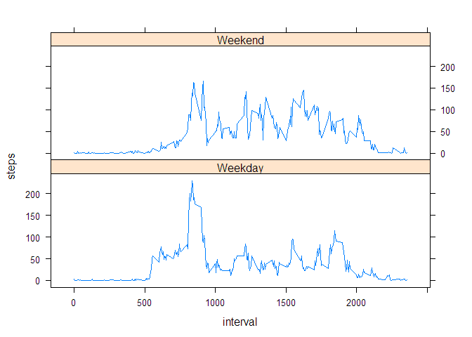

# Reproducible Research: Peer Assessment 1


## Loading and preprocessing the data


```r
# download data
#fil<-"https://d396qusza40orc.cloudfront.net/repdata%2Fdata%2Factivity.zip"

#download.file(fil,destfile="activity.zip",method="curl")

unzip(zipfile="activity.zip",overwrite = TRUE)

#import file 
activity_obj<-read.csv("activity.csv")

activity_obj_copy<-activity_obj

# get rows that have no NA
activity_obj<-activity_obj[!is.na(activity_obj$steps),]

# remove zero data rows
#no_zero_rows <- activity_obj[activity_obj$steps>0,]
no_zero_rows <- activity_obj
```

## What is mean total number of steps taken per day?

```r
# calculate total steps per day
total_steps_per_day  <- tapply(activity_obj_copy$steps, activity_obj_copy$date, sum)

# calulcate mean per day
var_num_mean <- mean(total_steps_per_day,na.rm=TRUE)

#calculate median per day
var_num_median<-median(total_steps_per_day,na.rm=TRUE)
```
###mean total steps per day:

```
## [1] 10766.19
```
###median total steps per day:

```
## [1] 10765
```

## What is the average daily activity pattern?

```r
#histogram of total number of steps
var_disp_hist <- hist(total_steps_per_day,main="Total Steps",xlab='Total Steps (Per Day)',col='blue')
```

 


```
## $breaks
## [1]     0  5000 10000 15000 20000 25000
## 
## $counts
## [1]  5 12 28  6  2
## 
## $density
## [1] 1.886792e-05 4.528302e-05 1.056604e-04 2.264151e-05 7.547170e-06
## 
## $mids
## [1]  2500  7500 12500 17500 22500
## 
## $xname
## [1] "total_steps_per_day"
## 
## $equidist
## [1] TRUE
## 
## attr(,"class")
## [1] "histogram"
```

```r
# get average steps by interval
average_steps_by_interval <- aggregate(no_zero_rows$steps,by=list(no_zero_rows$interval),mean)

#plot average steps over all days by day interval
library(ggplot2)
var_disp_g<-ggplot(average_steps_by_interval) + 
  geom_line(aes(x=average_steps_by_interval$Group.1,y=average_steps_by_interval$x,label=average_steps_by_interval$x)) + 
  geom_point(aes(x=average_steps_by_interval$Group.1,
                 y=average_steps_by_interval$x)) + 
  geom_text(aes(x=average_steps_by_interval$Group.1,
                y=average_steps_by_interval$x,
                label=ifelse(average_steps_by_interval$x==max(average_steps_by_interval$x),
                             paste("Max Average Steps:",
                                   as.integer(average_steps_by_interval$x)," on interval ",
                                   as.character(average_steps_by_interval$Group.1/5)),'')),
            hjust=0,just=0,colour="red") +
  theme(panel.grid.major.y = element_line(colour = "blue")) + 
  labs(x="Daily Interval",
       y=expression("Average Steps")) +
  labs(title=expression("Average Steps Per Interval per Day"))
```
 

## Imputing missing values

```r
#report number of rows na
var_num_rows_na<-is.na(activity_obj_copy$steps)

#fill in na
mean_steps_per_day <- tapply(activity_obj_copy$steps, activity_obj_copy$interval, mean, na.rm = TRUE)
na_indices <- which(is.na(activity_obj_copy))
#generate object with filler values
filler_values <- mean_steps_per_day[as.character(activity_obj_copy[na_indices, 3])]
names(filler_values) <- na_indices
#fill in
activity_obj_steps_na <- activity_obj_copy
for (i in na_indices) {
  activity_obj_steps_na$steps[i] = filler_values[as.character(i)]
}


#calculate total steps with revised data
# calculate total steps per day
total_steps_per_day2  <- tapply(activity_obj_steps_na$steps, activity_obj_steps_na$date, sum)
#histogram of total number of steps
var_disp_hist2 <- hist(total_steps_per_day2,main="Total Steps",xlab='Total Steps (Per Day)',col='orange')
```

 

There is a noticeable change in the data when filling NA with the average daily mean. It would definitely inflate results undesirably.


```
## $breaks
## [1]     0  5000 10000 15000 20000 25000
## 
## $counts
## [1]  5 12 36  6  2
## 
## $density
## [1] 1.639344e-05 3.934426e-05 1.180328e-04 1.967213e-05 6.557377e-06
## 
## $mids
## [1]  2500  7500 12500 17500 22500
## 
## $xname
## [1] "total_steps_per_day2"
## 
## $equidist
## [1] TRUE
## 
## attr(,"class")
## [1] "histogram"
```

## Are there differences in activity patterns between weekdays and weekends?

```r
library(lattice)
#compare weekdays and weekends
days <- weekdays(as.Date(activity_obj_steps_na$date))
activity_obj_steps_na$daytype <- ifelse(days == "Saturday" | days == "Sunday", "Weekend", "Weekday")
mean_steps_per_day2 <- aggregate(activity_obj_steps_na$steps, 
                                 by = list(activity_obj_steps_na$interval, activity_obj_steps_na$daytype), 
                                 mean)
names(mean_steps_per_day2) <- c("interval", "day_type", "steps")
var_disp_xyplot<- xyplot(steps ~ interval | day_type, 
                        mean_steps_per_day2, 
                        type = "l", 
                        layout = c(1, 2), 
                        xlab = "interval", 
                        ylab = "steps")
```
There is a noticeable difference between weekend and weekday.

 
